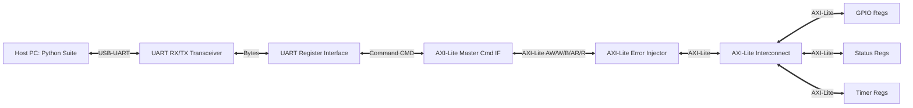

# AXI-Lite Register Validation Framework Detailed Project Specification

This document provides the hardware and software engineering specifications for the AXI-Lite Register Validation system on the Lenseup EDGE Artix-7 FPGA development board.

---

## 1. System Block Diagram and Architecture

The platform allows a host computer to read and write internal FPGA registers over a single USB cable, translating serial packets to AXI-Lite transactions. The system is partitioned into the following functional layers:



### Module Descriptions:
1. **UART RX/TX Transceivers (`uart_rx`, `uart_tx`)**: Converts serial 8-N-1 UART waveforms into parallel bytes (and vice versa) at 115,200 Baud.
2. **UART Register Interface (`uart_register_interface`)**: Decodes serial request byte packets into register write/read commands and serializes AXI-Lite response data back into byte streams.
3. **AXI-Lite Master Command Interface (`axi_lite_master_cmd_if`)**: Active master that drives the AXI-Lite channels (AW, W, B, AR, R) depending on command requests. It implements an internal timeout counter to avoid bus hangs.
4. **AXI-Lite Error Injector (`axi_lite_error_injector`)**: Debugging hook situated between the Master and Interconnect. It can inject artificial handshaking stalls (withholding `READY` lines) or byte errors for boundary testing.
5. **AXI-Lite Interconnect (`axi_lite_interconnect`)**: Decodes addresses and routes AXI-Lite transactions to the appropriate slave blocks (`gpio`, `status`, or `timer`).
6. **Register Slave Blocks (`axi_lite_gpio_regs`, `axi_lite_status_regs`, `axi_lite_timer_regs`)**: Functional registers mapped to specific base addresses.
7. **Passive Monitors**:
   * **`axi_lite_protocol_checker`**: Continuously monitors handshaking channels to ensure specifications (like stable write address and data during handshakes) are not violated.
   * **`register_access_monitor`**: Counts read/write operations and tracks the last accessed address.
   * **`reset_recovery_monitor`**: Monitors bus activity during reset.

---

## 2. Electrical and Interface Configurations

### Physical Configurations:
* **Target Device**: Xilinx Artix-7 `xc7a35tftg256-1`
* **System Clock Frequency**: **50 MHz** (`period = 20.00 ns`) via pin `N11`.
* **System Reset Button**: Center push button `pb[4]` on pin `M14`. It is pulled down physically, meaning it outputs `High` when pressed. The top-level RTL wrapper inverts this (`wire rst_n = ~rst_n_pin;`) to generate an active-low reset.

### UART Settings:
* **Baud Rate**: **115,200** bps.
* **Character Size**: 8 data bits.
* **Parity**: None (N).
* **Stop Bits**: 1.
* **Physical Pins**: FPGA RX on pin `D4`, FPGA TX on pin `C4`.

---

## 3. UART-to-AXI Packet Protocol Framing

All communications between the Host PC (Python Validation Suite) and the FPGA target are packaged into strict byte arrays.

### A. Write Transaction (Write to Register)
1. **Request Packet (9 bytes)**:
   ```
   [0x57] [ADDR_B3] [ADDR_B2] [ADDR_B1] [ADDR_B0] [DATA_B3] [DATA_B2] [DATA_B1] [DATA_B0]
   ```
   * Byte 0: Opcode `0x57` (ASCII character `'W'`).
   * Bytes 1-4: 32-bit destination register byte address (big-endian).
   * Bytes 5-8: 32-bit data to be written (big-endian).

2. **Response Packet (6 bytes)**:
   ```
   [STATUS] [DATA_B3] [DATA_B2] [DATA_B1] [DATA_B0] [0x57]
   ```
   * Byte 0: AXI-Lite response status code.
   * Bytes 1-4: Write data echoes (big-endian).
   * Byte 5: Opcode `0x57` echo.

---

### B. Read Transaction (Read from Register)
1. **Request Packet (5 bytes)**:
   ```
   [0x52] [ADDR_B3] [ADDR_B2] [ADDR_B1] [ADDR_B0]
   ```
   * Byte 0: Opcode `0x52` (ASCII character `'R'`).
   * Bytes 1-4: 32-bit source register byte address (big-endian).

2. **Response Packet (6 bytes)**:
   ```
   [STATUS] [DATA_B3] [DATA_B2] [DATA_B1] [DATA_B0] [0x52]
   ```
   * Byte 0: AXI-Lite response status code.
   * Bytes 1-4: 32-bit read register data (big-endian).
   * Byte 5: Opcode `0x52` echo.

---

### C. AXI-Lite Status Codes
The first byte of the response packet tells the host if the transaction was successful:
* **`0x00`**: `OKAY` (Normal access success)
* **`0x01`**: `EXOKAY` (Exclusive access - not used, indicates general protocol warning)
* **`0x02`**: `DECERR` (Decode Error - address does not map to any active block)
* **`0x03`**: `TIMEOUT` (Transaction timed out because the slave failed to assert `READY`)

---

## 4. Address Decoding and Folding

The AXI-Lite interconnect decodes addresses using a base boundary map:
* **GPIO Base**: `0x00000000` (matches range `0x00` to `0xFF`)
* **Status Base**: `0x00000100` (matches range `0x100` to `0x1FF`)
* **Timer Base**: `0x00000200` (matches range `0x200` to `0x2FF`)

### Address Folding:
To simplify the RTL address decoder, registers within each base block are decoded using only bits `[3:2]`. This means:
* Addresses are word-aligned automatically.
* Any unaligned access is folded down to the nearest multiple of 4. For example:
  * Reading from `0x02` is folded to `0x00` (reads `GPIO_OUT`).
  * Reading from `0x0C` and `0xCC` both wrap to offset `0x0C` (reads `SCRATCH`).
* Any access completely outside the mapped blocks (e.g. `0x00000300`) is rejected and returns `DECERR`.

---

## 5. AXI-Lite Bus Handshaking Signals

The AXI-Lite interface operates on five channels, each using a `VALID` / `READY` handshake protocol:

### Write Transaction Channels:
1. **Write Address Channel (`AW`)**:
   * `s_axi_awaddr`: Address to write.
   * `s_axi_awvalid`: Driven High by Master when address is valid.
   * `s_axi_awready`: Driven High by Slave when it is ready to accept the address.
2. **Write Data Channel (`W`)**:
   * `s_axi_wdata`: Data to write.
   * `s_axi_wstrb`: Byte write strobes (set to `4'b1111` for 32-bit write).
   * `s_axi_wvalid`: Driven High by Master when data is valid.
   * `s_axi_wready`: Driven High by Slave when ready to write.
3. **Write Response Channel (`B`)**:
   * `s_axi_bresp`: Status response from Slave (`2'b00` = `OKAY`, `2'b11` = `DECERR`).
   * `s_axi_bvalid`: Driven High by Slave when response is ready.
   * `s_axi_bready`: Driven High by Master when it has received response.

### Read Transaction Channels:
1. **Read Address Channel (`AR`)**:
   * `s_axi_araddr`: Address to read.
   * `s_axi_arvalid`: Driven High by Master when address is valid.
   * `s_axi_arready`: Driven High by Slave when ready to accept read address.
2. **Read Data Channel (`R`)**:
   * `s_axi_rdata`: Data read from register.
   * `s_axi_rresp`: Status response (`2'b00` = `OKAY`, `2'b11` = `DECERR`).
   * `s_axi_rvalid`: Driven High by Slave when read data is valid.
   * `s_axi_rready`: Driven High by Master when ready to accept read data.

---

## 6. Passive Hardware Monitors and Registers

The system contains passive hardware monitors to watch and debug the AXI-Lite bus logic in real-time.

### A. Protocol Checker (`axi_lite_protocol_checker`)
* Watches the bus signals for violations of the AXI specification.
* Specifically, it asserts `violation_pulse` if:
  * Address (`awaddr`) changes while `awvalid` is High but before `awready` handshakes.
  * Data (`wdata`) changes while `wvalid` is High but before `wready` handshakes.
* When a violation occurs, the monitor latches it and exposes it to `STATUS_FLAGS[0]` (`proto_err`).

### B. Access Monitor (`register_access_monitor`)
* Passively increments a counter on every successful bus handshake.
* Exposes:
  * Total read transactions count.
  * Total write transactions count.
  * Number of transactions that returned an error status.
  * The address offset of the last register that was accessed.

### C. Reset Recovery Monitor (`reset_recovery_monitor`)
* Ensures that if the system reset pin `rst_n` is pressed, no bus transactions can be initiated until a predefined stabilization window (e.g. 16 clock cycles) has passed.
* If a master attempts to access the bus before the reset recovery period ends, the monitor sets `STATUS_FLAGS[3]` (`reset_in_prog`) and asserts a premature access warning.
