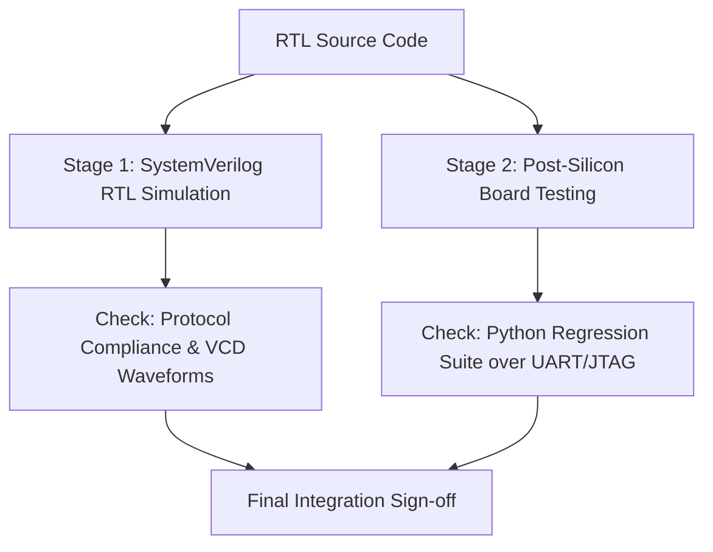

# AXI-Lite Register Verification & Validation Plan

This plan establishes the strategic validation flow for the AXI-Lite Register Subsystem, ensuring full functional correctness and hardware compatibility.

---

## 1. Validation Strategy Overview

To achieve production-grade reliability, we utilize a **Dual-Stage Verification Method**:

---

## 2. Stage 1: SystemVerilog RTL Simulation (Pre-Silicon)

Prior to hardware synthesis, the design is verified in a simulation environment using Icarus Verilog.

### Testbenches & Objectives:
1. **`tb_axi_lite_protocol_checker.sv`**: Verifies that passive monitors flag handshaking protocol violations on the bus channels (e.g., changing address before write handshake is done).
2. **`tb_axi_lite_register_block.sv`**: Direct testing of internal block offsets, boundary reads/writes, and default state verification.
3. **`tb_axi_lite_master_cmd_if.sv`**: Simulates the command interface and tests timeout counters by mimicking unresponsive slaves.
4. **`tb_axi_lite_error_injector.sv`**: Verifies that injection registers correctly corrupt AXI-Lite handshake signals or report artificial transfer failures.
5. **`tb_register_access_monitor.sv`**: Verifies tracking registers, confirming transaction counters increment exactly with bus activity.
6. **`tb_top_axi_lite_register_validation.sv`**: System-level simulation mapping UART inputs to register outputs.

---

## 3. Stage 2: Post-Silicon Board Testing (Post-Silicon)

Once compiled and loaded to the Artix-7 board, the design is tested via a Python validation suite sending packets over the serial connection.

### Scope of Verification:
* **Reset Recovery Validation**: Ensures registers boot to default values and recovery logic responds properly.
* **Access Policy Boundary Verification**: Verifies RO, WO, and RW permissions.
* **Stuck-at Faults Detection**: Exercises walking bit toggle checks across all 32 bits of RW registers.
* **Address Fold Verification**: Verifies folding behavior on bits `[3:2]` to verify alignment-free decoding.
* **Timeout and Bus Hang Prevention**: Verifies that if an access hang is simulated (via error injection), the Master correctly breaks the transaction and returns a `TIMEOUT` code instead of lockup.

---

## 4. Sign-Off and Acceptance Criteria

The design is accepted for production release when:
1. **Compilation**: All RTL modules compile without warnings or lint errors in Vivado.
2. **Simulation**: All 6 SystemVerilog testbenches compile and pass simulation with zero errors.
3. **Regression Tests**: All 7 Python regression test cases pass cleanly (either on physical hardware or in mock mode).
4. **Coverage Goals**:
   * **Register Access Coverage**: 100%
   * **Bit Toggle Coverage**: 100%
   * **Access Policy Coverage**: 100%
5. **Reporting**: Automatically generated `dashboard.html` and `report.html` are archived with date, version, and signature metadata.
